# Wo Bot 架构图

> 最后更新：2026-07-19 | 对应版本：wo-bot-control v0.2.5

---

## 一、整体系统架构

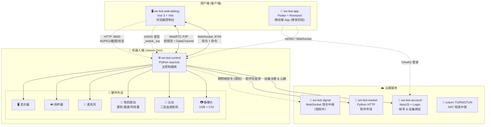

---

## 二、机器人端 (wo-bot-control) 模块架构

```mermaid
graph TB
    subgraph 入口["入口"]
        Main["WoBotControl<br/>main.py<br/>主控制器 & 生命周期"]
    end

    subgraph Core["Core 核心服务层"]
        WS["WebSocketServer<br/>websocket_server.py<br/>客户端连接入口 :8765"]
        RTC["WebRTCService<br/>webrtc_service.py<br/>视频推流 + DataChannel"]
        MsgHandler["MessageHandler<br/>message_handler.py<br/>消息路由中枢"]
        MDNS["MDNSService<br/>mdns_service.py<br/>mDNS 局域网发现"]
        HTTP["HttpAPIServer<br/>http_api.py<br/>HTTP API :8000"]
        SvcMgr["ServiceManager<br/>service_manager.py<br/>子进程守护管理"]
        BindMgr["BindingManager<br/>binding_manager.py<br/>HMAC 绑定认证"]
        AcctClient["AccountClient<br/>account_client.py<br/>帐号服务器对接"]
        PeriDetect["PeripheralDetector<br/>peripheral_detector.py<br/>外设可用性检测"]
    end

    subgraph Modules["Modules 功能模块层"]
        Motion["Motion 运动控制<br/>motion/motion_controller.py<br/>麦轮/差速/阿克曼"]
        Camera["Vision 视觉<br/>vision/camera.py<br/>OpenCV 采集 VP8 编码"]
        System["System 系统<br/>system/system_info.py<br/>CPU/GPU/电池/网络"]
        Power["PowerPolicy 省电<br/>system/power_policy.py<br/>动态降频策略"]
        Dance["DanceController<br/>extension/dance.py<br/>舞蹈编排"]
        Voice["VoiceBroadcast<br/>extension/voice_broadcast.py<br/>语音喊话"]
        FindDevice["FindDevice<br/>extension/find_device.py<br/>寻找蓝牙设备"]
    end

    subgraph SubServices["Sub Services 子进程服务"]
        Music["MusicPlayer<br/>sub_services/music_player.py<br/>本地音乐播放"]
        DLNA["PyDLNARenderer<br/>sub_services/py_dlna_renderer.py<br/>DLNA 投屏"]
        RemoteCtrl["RemoteControl<br/>sub_services/remote_control.py<br/>遥控子服务"]
        AdvCollector["AdvancedCollector<br/>sub_services/advanced_collector.py<br/>高级数据采集"]
        SoftMgr["SoftwareManager<br/>sub_services/software_manager.py<br/>软件包管理"]
    end

    subgraph Utils["Utils 工具层"]
        Logger["Logger<br/>utils/logger.py<br/>日志管理 (轮转)"]
        TTS["TTSEngine<br/>utils/tts.py<br/>espeak + aplay"]
        QR["QRScanner<br/>utils/qr_scanner.py<br/>二维码扫描"]
    end

    subgraph Hardware["Hardware 硬件抽象层"]
        HW_Motion["MotionBackend<br/>mock / serial / gpio / rosmaster"]
        HW_Camera["CameraBackend<br/>USB cam0 + CSI cam1"]
        HW_Gimbal["GimbalBackend<br/>PWM 舵机控制"]
    end

    Main --> WS
    Main --> RTC
    Main --> MsgHandler
    Main --> MDNS
    Main --> HTTP
    Main --> SvcMgr
    Main --> BindMgr
    Main --> AcctClient
    Main --> PeriDetect

    WS --> MsgHandler
    RTC --> MsgHandler

    MsgHandler --> Motion
    MsgHandler --> Camera
    MsgHandler --> System
    MsgHandler --> Power
    MsgHandler --> Dance
    MsgHandler --> Voice
    MsgHandler --> FindDevice

    SvcMgr --> Music
    SvcMgr --> DLNA
    SvcMgr --> RemoteCtrl
    SvcMgr --> AdvCollector
    SvcMgr --> SoftMgr

    Motion --> HW_Motion
    Camera --> HW_Camera
    Dance --> HW_Gimbal

    MsgHandler -.-> Logger
    Voice -.-> TTS
```

### 模块职责表

| 层 | 模块 | 职责 |
|----|------|------|
| **Core** | WebSocketServer | WebSocket 信令服务器，客户端连接入口，消息收发 :8765 |
| **Core** | WebRTCService | aiortc 视频推流 (VP8) + DataChannel 业务通道 |
| **Core** | MessageHandler | 消息路由中枢，解析客户端指令 → 分发功能模块 |
| **Core** | MDNSService | zeroconf 局域网服务发现 `_wobot._tcp.local.` |
| **Core** | HttpAPIServer | HTTP API :8000 (MJPEG 流、截图、状态查询) |
| **Core** | BindingManager | HMAC-SHA256 绑定认证，PBKDF2 密码验证 |
| **Core** | AccountClient | 对接 wo-bot-account (设备注册 + 心跳 + 绑定证明) |
| **Core** | ServiceManager | 子进程生命周期管理 (启动/停止/重启守护) |
| **Modules** | Motion | 运动控制 (mecanum/differential/ackermann)，多硬件后端 |
| **Modules** | Vision | OpenCV 摄像头采集，双摄像头支持 |
| **Modules** | System | CPU/GPU/内存/电池/网络状态采集 |
| **Modules** | PowerPolicy | 省电策略引擎 (动态降频阈值) |
| **Modules** | Dance/ Voice/ FindDevice | 扩展功能 (舞蹈编排、语音喊话、寻找设备) |
| **SubServices** | Music/ DLNA/ Remote | 独立子进程服务 (音乐、投屏、遥控) |
| **SubServices** | SoftwareManager | 对接 wo-bot-market 软件包管理 |
| **Utils** | Logger/ TTS/ QR | 日志、TTS 语音合成、二维码扫描 |

---

## 三、Web 前端 (wo-bot-web-debug) 架构

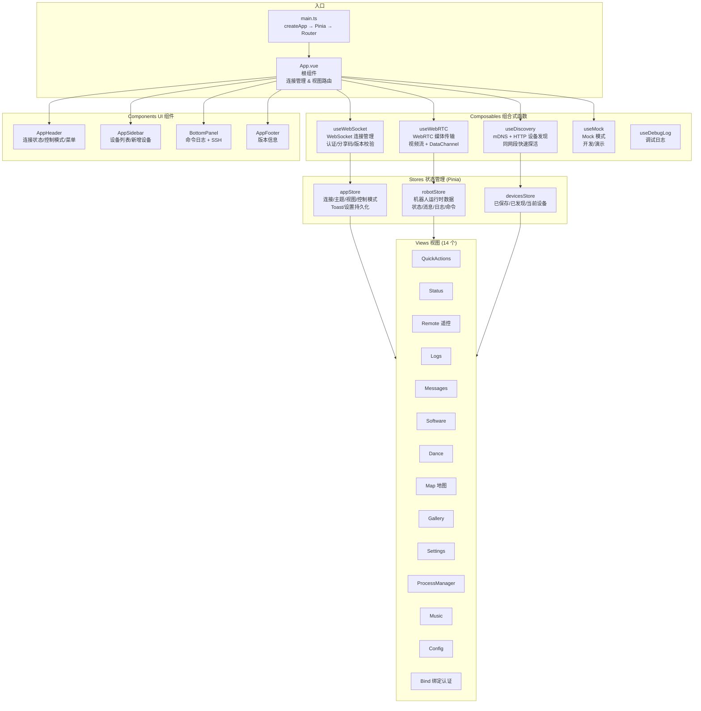

---

## 四、通信架构与数据流

### 4.1 连接建立流程

```mermaid
sequenceDiagram
    participant Browser as 🌐 浏览器 (Web 控制台)
    participant Robot as 🤖 机器人 (wo-bot-control)
    participant Account as ☁️ wo-bot-account

    Note over Browser, Robot: === 局域网发现 ===
    Browser->>Robot: mDNS 查询 _wobot._tcp.local.
    Robot-->>Browser: 返回 IP + 端口 + 设备信息

    Note over Browser, Robot: === WebSocket 连接 ===
    Browser->>Robot: ws://<ip>:8765 连接
    Robot-->>Browser: connected (robot_id, features, ...)

    alt 已绑定
        Browser->>Robot: auth_request (HMAC 签名)
        Robot-->>Browser: auth_success
    else 未绑定
        Robot-->>Browser: auth_required
        Browser->>Robot: bind_request (密码)
        Robot->>Account: 签发绑定证明
        Robot-->>Browser: bind_success
    end

    Note over Browser, Robot: === WebRTC P2P 建立 ===
    Browser->>Robot: WebSocket: webrtc_offer (SDP)
    Robot-->>Browser: WebSocket: webrtc_answer (SDP)
    Browser->>Robot: ICE Candidate 交换
    Robot-->>Browser: ICE Candidate 交换
    Note over Browser, Robot: P2P 连接建立 ✅
    Browser<-->Robot: DataChannel (业务消息主通道)
    Browser<-->Robot: MediaStream (VP8 视频流)
```

### 4.2 双通道消息策略

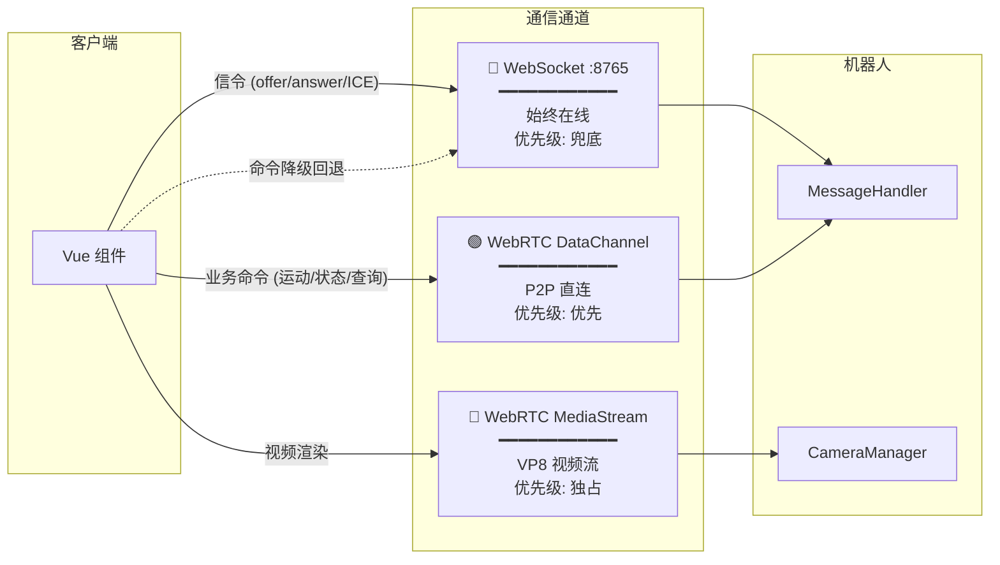

### 4.3 命令下发与状态上报

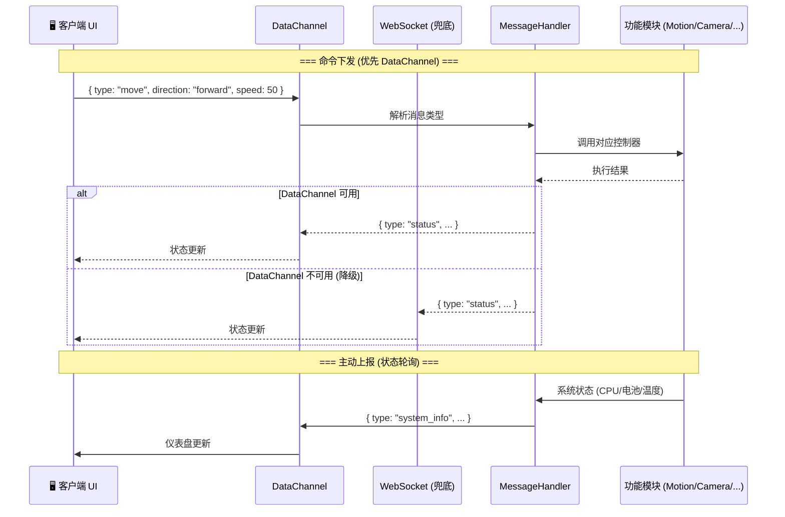

### 4.4 跨网络远程控制 (规划中)

```mermaid
sequenceDiagram
    participant Browser as 🌐 浏览器 (任意网络)
    participant Signal as 📡 wo-bot-signal 信令服务器
    participant TURN as 🔄 coturn TURN/STUN
    participant Robot as 🤖 机器人 (任意网络)

    Note over Browser, Robot: === 信令阶段 ===
    Browser->>Signal: WSS 连接 + 设备查询
    Robot->>Signal: WSS 连接 + 在线注册
    Signal-->>Browser: 设备列表
    Browser->>Signal: 连接请求 → 转发给机器人
    Signal-->>Robot: 连接请求

    Note over Browser, Robot: === WebRTC 协商 (经信令中继) ===
    Browser->>Signal: SDP Offer
    Signal->>Robot: SDP Offer
    Robot->>Signal: SDP Answer
    Signal->>Browser: SDP Answer

    Note over Browser, Robot: === ICE / NAT 穿透 ===
    Browser->>TURN: 获取中继地址
    Robot->>TURN: 获取中继地址

    alt P2P 直连成功
        Browser<-->Robot: WebRTC P2P
    else NAT 严格 (TURN 中继)
        Browser<-->TURN: 视频 + 数据中继
        TURN<-->Robot: 视频 + 数据中继
    end
```

---

## 五、帐号服务 (wo-bot-account) 架构

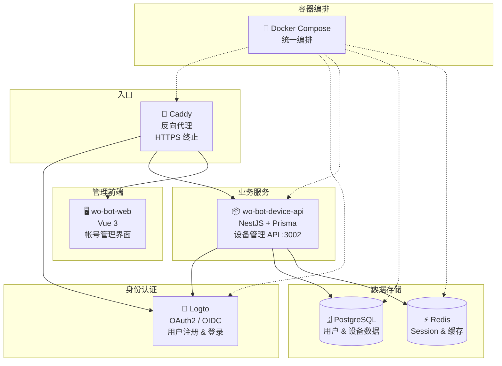

### API 接口

| 端点 | 方法 | 说明 |
|------|------|------|
| `/api/devices/register` | POST | 设备注册 (HMAC 签名认证) |
| `/api/devices/heartbeat` | POST | 设备心跳上报 |
| `/api/binding/proof` | POST | 签发绑定证明 (OAuth2 保护) |
| `/api/binding/verify` | POST | 验证绑定关系 |
| `/api/discover` | GET | 查询用户已绑定设备列表 |

---

## 六、部署架构

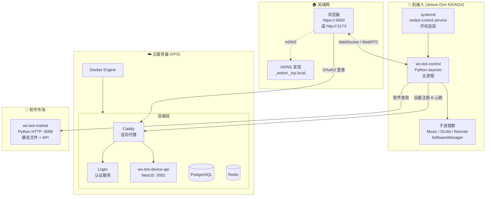

---

## 七、技术栈总览

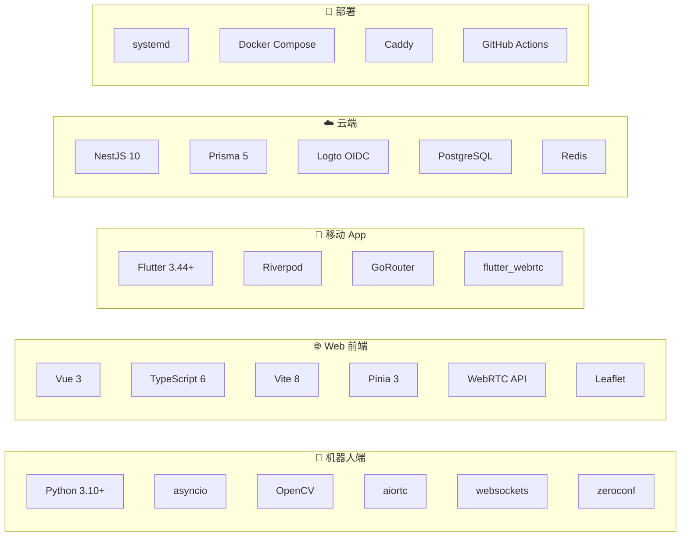

---

## 八、未来架构：wo-bot-signal 信令服务器 (Phase 3 详细设计)

> 状态：🔴 规划设计中 | 对应 Phase：R00036 (授权与信令服务器) + R00037 (跨网络远程连接)

### 8.1 设计原则

信令服务器 **不持有用户/设备归属数据**，所有鉴权决策委托给 `wo-bot-account`：
- 信令服务器只负责 **WebSocket 连接管理 + WebRTC 信令转发**
- 用户身份由 wo-bot-account 签发的 JWT 承载，信令服务器验签不验库
- 设备绑定关系由 wo-bot-account 存储，信令服务器每次连接时实时校验
- 信令服务器无数据库，仅内存中维护连接房间表 + Redis 缓存绑定验证结果

### 8.2 信令服务器模块架构

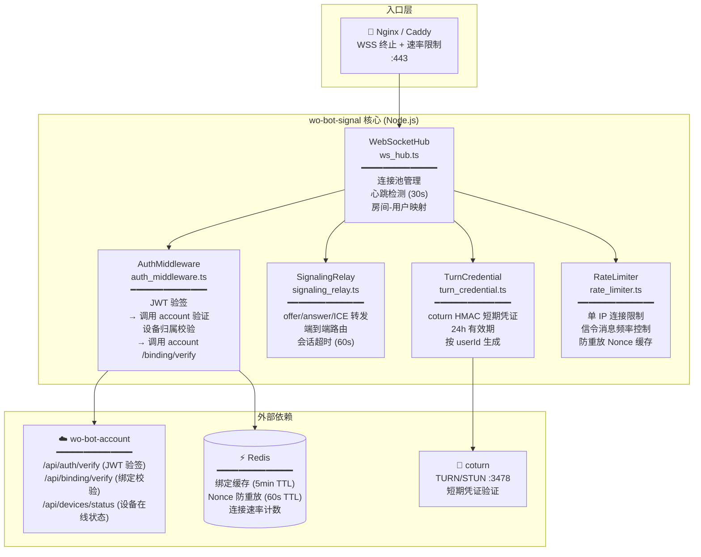

### 8.3 三端鉴权模型

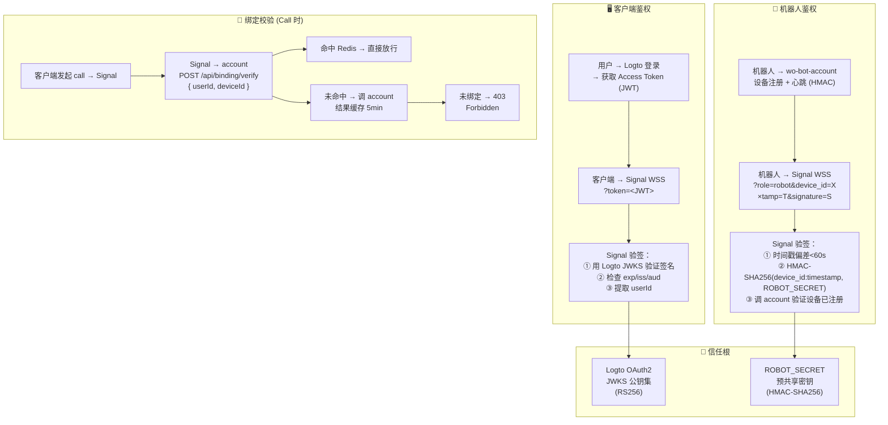

### 8.4 完整远程连接时序

```mermaid
sequenceDiagram
    actor User as 👤 用户 (浏览器/App)
    participant Client as 🖥️ 客户端
    participant Logto as 🔐 Logto (wo-bot-account)
    participant Signal as 📡 wo-bot-signal
    participant Account as 📦 wo-bot-device-api
    participant Robot as 🤖 机器人

    Note over User, Robot: ═══ Phase A: 用户登录 & 鉴权 ═══

    User->>Client: 打开控制台
    Client->>Logto: OAuth2 Authorization Code Flow
    Logto-->>Client: Access Token (JWT, RS256, 1h)
    Logto-->>Client: Refresh Token (7d)

    Client->>Signal: WSS 连接<br/>?token=&lt;JWT&gt;

    Note over Signal: ① JWT 验签<br/>用 Logto JWKS 验证签名<br/>提取 userId + exp
    alt JWT 无效/过期
        Signal-->>Client: 401 Unauthorized
        Client->>Logto: 用 Refresh Token 换新 Access Token
        Client->>Signal: 重试连接
    end

    Signal-->>Client: connected + 设备列表 (已绑定)

    Note over User, Robot: ═══ Phase B: 机器人上线 & 鉴权 ═══

    Robot->>Account: POST /api/devices/heartbeat<br/>(HMAC 签名)
    Account-->>Robot: 在线注册成功

    Robot->>Signal: WSS 连接<br/>?role=robot&device_id=ABC<br/>&timestamp=T&signature=HMAC

    Note over Signal: ② 机器人验签<br/>HMAC-SHA256(device_id:timestamp, ROBOT_SECRET)<br/>时间戳偏差 < 60s

    Signal->>Account: POST /api/devices/verify<br/>{ deviceId: "ABC" }
    Account-->>Signal: { registered: true, ownerId: "U1" }

    Signal-->>Robot: connected (信令通道就绪)
    Note over Signal: 内存注册: rooms["ABC"] = robotWs

    Note over User, Robot: ═══ Phase C: 发起远程连接 ═══

    User->>Client: 点击设备 "客厅小蜗 (ABC)"
    Client->>Signal: { type: "call", deviceId: "ABC" }

    Note over Signal: ③ 绑定校验<br/>Redis 缓存查询 → Miss

    Signal->>Account: POST /api/binding/verify<br/>Authorization: Bearer &lt;JWT&gt;<br/>{ deviceId: "ABC" }

    Note over Account: 查询 userId ↔ deviceId<br/>绑定关系表

    alt 未绑定
        Account-->>Signal: { bound: false }
        Signal-->>Client: { type: "error", code: "NOT_BOUND" }
    else 已绑定
        Account-->>Signal: { bound: true, deviceId: "ABC" }
        Note over Signal: Redis 缓存: bind:U1:ABC = true (5min TTL)

        Signal->>Robot: { type: "call_request", from: "userId" }
        Robot-->>Signal: { type: "call_accept" }

        Note over User, Robot: ═══ Phase D: WebRTC 信令交换 ═══

        Client->>Signal: { type: "offer", target: "ABC", sdp: "..." }
        Signal->>Robot: { type: "offer", from: "userId", sdp: "..." }
        
        Robot->>Signal: { type: "answer", target: "userId", sdp: "..." }
        Signal->>Client: { type: "answer", from: "ABC", sdp: "..." }

        loop ICE Candidate 交换
            Client->>Signal: { type: "ice", target: "ABC", candidate: {...} }
            Signal->>Robot: { type: "ice", from: "userId", candidate: {...} }
            Robot->>Signal: { type: "ice", target: "userId", candidate: {...} }
            Signal->>Client: { type: "ice", from: "ABC", candidate: {...} }
        end

        Note over Client, Robot: ═══ Phase E: P2P 连接建立 ═══

        Client<-->Robot: WebRTC P2P / TURN 中继<br/>DataChannel + 视频流

        Note over Signal: 连接建立后信令服务器<br/>仅维持心跳，不参与数据通道
    end
```

### 8.5 信令服务器内部状态模型

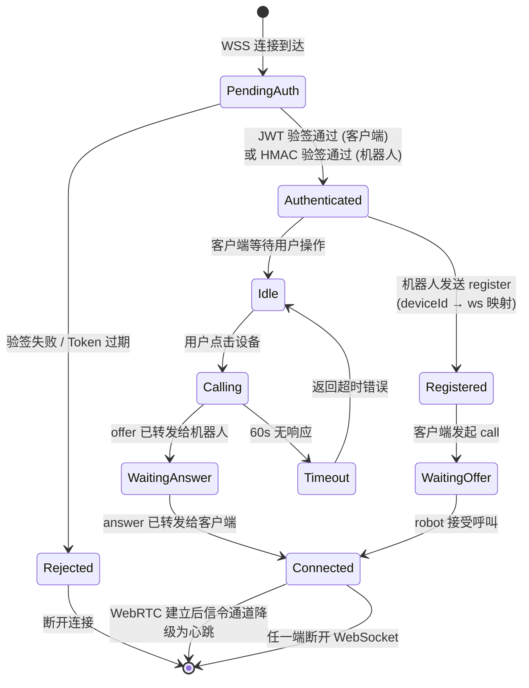

### 8.6 信令消息协议

#### 客户端 ↔ 信令服务器

| type | 方向 | payload | 说明 |
|------|------|---------|------|
| `call` | C→S | `{ deviceId }` | 发起连接请求 |
| `call_response` | S→C | `{ deviceId, accepted: bool, reason? }` | 机器人应答 |
| `offer` | C↔S | `{ target, sdp }` | SDP Offer (双向) |
| `answer` | C↔S | `{ target, sdp }` | SDP Answer (双向) |
| `ice` | C↔S | `{ target, candidate }` | ICE Candidate (双向) |
| `device_list` | S→C | `[{ deviceId, name, online }]` | 已绑定设备列表 |
| `device_online` | S→C | `{ deviceId }` | 设备上线通知 |
| `device_offline` | S→C | `{ deviceId }` | 设备离线通知 |
| `turn_credentials` | S→C | `{ username, password, urls, ttl }` | TURN 凭证下发 |
| `error` | S→C | `{ code, message }` | 错误响应 |

#### 机器人 ↔ 信令服务器

| type | 方向 | payload | 说明 |
|------|------|---------|------|
| `register` | R→S | `{ deviceId }` | 机器人在线注册 |
| `call_request` | S→R | `{ from: userId }` | 收到连接请求 |
| `call_accept` | R→S | `{}` | 接受连接 |
| `call_reject` | R→S | `{ reason? }` | 拒绝连接 |
| `offer` | R↔S | `{ target: userId, sdp }` | SDP Offer/Answer |
| `ice` | R↔S | `{ target: userId, candidate }` | ICE Candidate |
| `turn_credentials` | S→R | `{ username, password, urls, ttl }` | TURN 凭证下发 |
| `ping` | R↔S | `{}` | 心跳 (30s 间隔) |
| `pong` | R↔S | `{}` | 心跳响应 |

### 8.7 依赖 wo-bot-account 新增 API

信令服务器所需的鉴权 API（需在 wo-bot-device-api 中新增）：

| 端点 | 方法 | 认证 | 说明 |
|------|------|------|------|
| `/api/auth/verify` | POST | 服务间 API Key | 验证 JWT 有效性，返回 `{ userId, exp }` |
| `/api/binding/verify` | POST | Bearer JWT (用户) | 校验 `userId ↔ deviceId` 绑定关系 |
| `/api/devices/verify` | POST | 服务间 API Key | 验证设备是否已注册 `{ deviceId, registered, ownerId }` |
| `/api/devices/list` | GET | Bearer JWT (用户) | 查询用户所有已绑定设备及在线状态 |

### 8.8 Token 层级与流转

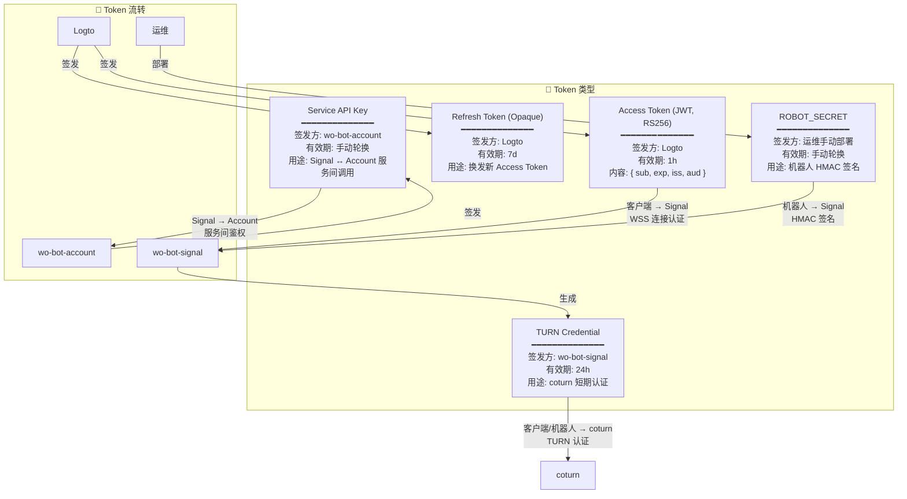

### 8.9 安全纵深防御

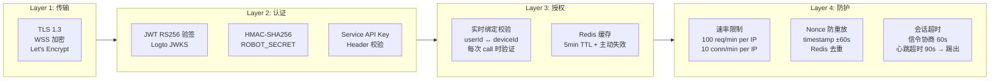

### 8.10 部署拓扑

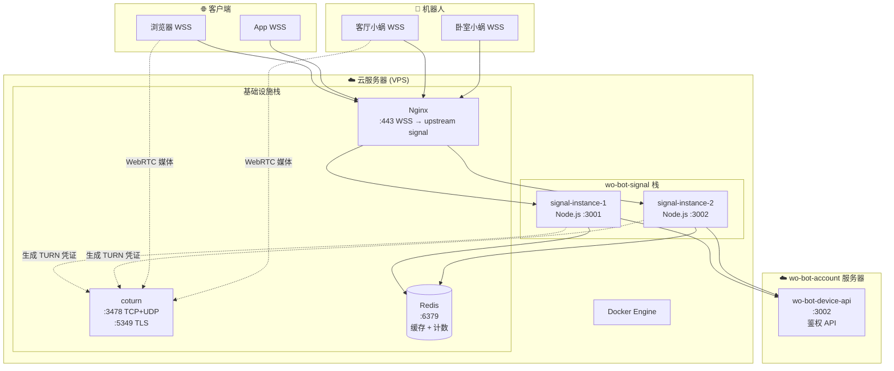

### 8.11 信令服务器仓库结构 (规划)

```
wo-bot-signal/
├── src/
│   ├── index.ts                  # 入口：启动 HTTP + WSS 服务
│   ├── config.ts                 # 配置加载 (环境变量)
│   ├── ws_hub.ts                 # WebSocket 连接池 & 房间管理
│   ├── auth_middleware.ts        # 鉴权中间件 (JWT + HMAC)
│   ├── signaling_relay.ts        # WebRTC 信令转发引擎
│   ├── turn_credential.ts        # coturn HMAC 短期凭证生成
│   ├── rate_limiter.ts           # 速率限制 & Nonce 防重放
│   ├── account_client.ts         # wo-bot-account API 客户端
│   └── types.ts                  # 类型定义
├── tests/
│   ├── auth.test.ts
│   ├── signaling.test.ts
│   └── integration.test.ts
├── package.json
├── tsconfig.json
├── Dockerfile
├── docker-compose.yml            # signal + redis + coturn
└── README.md
```

### 8.12 与现有架构的关系

```
                        ┌─────────────────────────────┐
                        │      wo-bot-account          │
                        │  ┌───────┐  ┌─────────────┐ │
                        │  │ Logto │  │ Device API  │ │
                        │  │ OAuth │  │ (绑定存储)   │ │
                        │  └───────┘  └──────┬──────┘ │
                        └────────────────────┼────────┘
                                             │
                    鉴权 API (绑定校验)       │
                                             │
    ┌────────────────────┐                   │
    │   wo-bot-signal    │←──────────────────┘
    │  (信令中继 + 鉴权)  │
    │  Node.js + Redis   │
    └──┬─────────────┬───┘
       │ WSS         │ WSS
       │ (客户端)     │ (机器人)
       ▼             ▼
  ┌─────────┐  ┌──────────────────────┐
  │ 浏览器   │  │  wo-bot-control      │
  │ / App   │  │  + signal_client.py  │ ← 新增模块
  └────┬────┘  └──────────┬───────────┘
       │                  │
       └──── WebRTC ──────┘
       (P2P 或 TURN 中继)

  局域网直连模式 (mDNS + ws://:8765) 保留作为降级方案
```

---

## 九、开发阶段与当前状态

| 阶段 | 内容 | 状态 |
|------|------|:--:|
| **Phase 1** | 核心基础：WebSocket + WebRTC 双通道、视频推流、运动/云台控制、前端 UI | ✅ 完成 |
| **Phase 2** | 交互增强：语音喊话、录音发送、实时通话 | ✅ 完成 |
| **Phase 3** | 跨网络远程控制：本地绑定、信令服务器、跨网络连接 | 🔄 进行中 |
| **Phase 4** | 智能能力：AI 避障、人体跟随、TTS/ASR、灯球音乐同步 | ⏳ 规划 |
| **Phase 5** | 生态拓展：自动充电、红外遥控、多机器人组网、4G/5G、原生 App | ⏳ 规划 |

---

## 十、项目仓库结构一览

```
wo-bot/
├── wo-bot-control/          # 🤖 机器人端控制服务 (Python asyncio)
│   ├── src/
│   │   ├── main.py          #   主入口 WoBotControl
│   │   ├── core/            #   核心服务层 (10 个模块)
│   │   ├── modules/         #   功能模块 (motion/vision/system/extension)
│   │   ├── sub_services/    #   子进程服务 (5 个)
│   │   └── utils/           #   工具层 (logger/tts/qr_scanner)
│   ├── config/config.yaml   #   运行时配置
│   └── scripts/             #   部署/安装脚本
│
├── wo-bot-web-debug/        # 🌐 Web 控制台 (Vue 3 + TypeScript + Vite)
│   └── src/
│       ├── components/      #   UI 组件 (Header/Sidebar/BottomPanel + views/)
│       ├── composables/     #   组合式函数 (useWebSocket/useWebRTC/useDiscovery)
│       ├── stores/          #   Pinia 状态管理 (app/devices/robot)
│       ├── router/          #   Vue Router
│       └── types/           #   TypeScript 类型定义
│
├── wo-bot-account/          # 🔐 帐号与设备管理服务 (NestJS + Logto + Docker)
│   ├── packages/
│   │   ├── wo-bot-device-api/   # NestJS 设备管理 API
│   │   └── wo-bot-web/          # Vue 3 管理前端
│   ├── logto/                   # Logto 认证服务
│   └── docker-compose.yml       # 容器编排
│
├── wo-bot-app/              # 📱 移动端 App (Flutter, 骨架阶段)
├── wo-bot-market/           # 🛒 软件市场 (Python HTTP)
├── wo-bot-signal/           # 📡 信令服务器 (Node.js + Redis, 规划中)
├── wo-bot-wiki/             # 📚 项目方案与文档
├── docs/                    # 📄 公共服务部署指南
├── scripts/                 # 🔧 批量操作脚本
└── secret/                  # 🔑 敏感凭证
```
